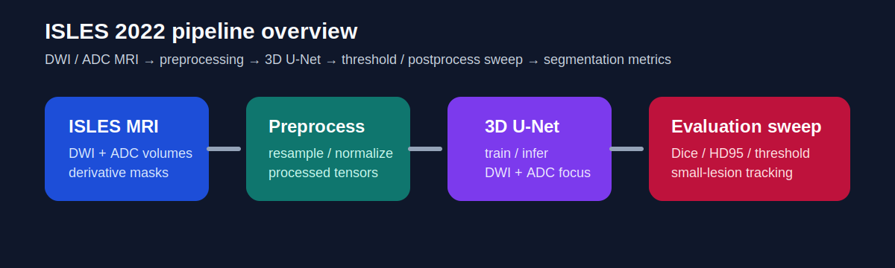
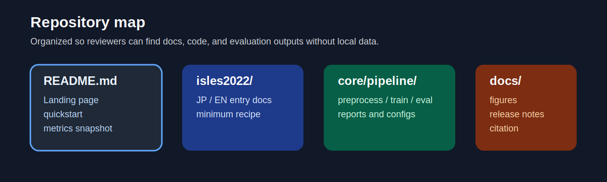
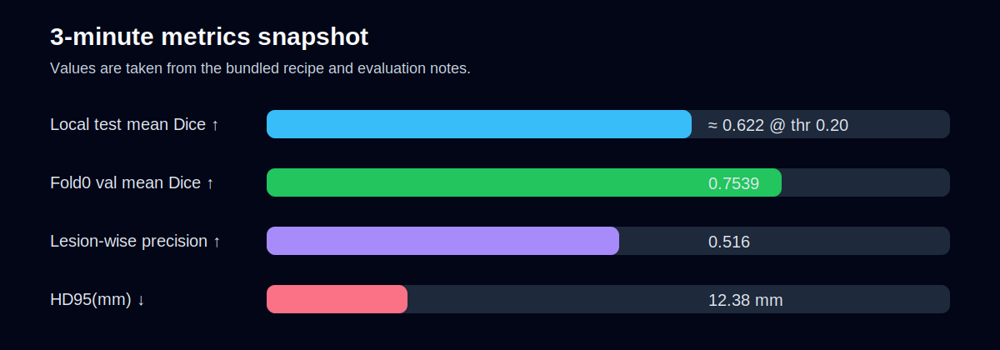

# isles2022-3d-reproducible-pipeline

**Language:** 日本語 | [English](README.md)

ISLES 2022 向けの、**再現可能な 3D 脳梗塞病変セグメンテーションパイプライン**です。監査しやすいドキュメント、threshold / postprocess sweep、サイズ別評価を含みます。

**クイックリンク**
- 英語入口: [isles2022/README_en.md](isles2022/README_en.md)
- 日本語入口: [isles2022/README.md](isles2022/README.md)
- 実験詳細: [isles2022/README.md](isles2022/README.md)
- Citation: [CITATION.cff](CITATION.cff)
- リリースノート原稿: [docs/releases/v1.0-interview.md](docs/releases/v1.0-interview.md)
- ロードマップ: [ROADMAP.md](ROADMAP.md)

## このリポジトリで分かること

- ISLES 2022 病変セグメンテーションの preprocess → train → evaluate ワークフロー
- 3D U-Net ベースラインと threshold / connected-component sweep
- 小病変を意識したサイズ別レポート
- 外部レビュー向けに整理したポートフォリオ導線
- 実データ不要で配線確認できる no-data smoke test

## 想定読者

- 医療AIセグメンテーション実装を確認したい採用担当
- 監査しやすい MRI セグメンテーション基盤を見たい ML エンジニア
- 再現性重視の ISLES 系プロジェクト構成を探している研究者

## 3分で分かる概要







### 代表指標

| 指標 | 値 | 意味 |
|---|---:|---|
| Local test mean Dice | ≈ 0.622 @ threshold 0.20 | 公開レシピの実用的な性能目安 |
| Fold0 validation mean Dice | 0.7539 | in-distribution な validation の強さ |
| Lesion-wise precision | 0.516 | FP 制御とのトレードオフ |
| HD95 | 12.38 mm | 境界品質の指標 |

> 数値は同梱レシピ / 評価メモ由来です。医療データ本体は公開物に含めていません。

## Quickstart

### 1. 実データなしで配線確認

```bash
python scripts/smoke_test.py --use_dummy_data
```

### 2. 配布物マニフェストを確認

```bash
cd core/pipeline
python tools/make_manifest.py
```

### 3. 実データで前処理 / 学習 / 評価

- 日本語詳細: [isles2022/README.md](isles2022/README.md)
- English full guide: [isles2022/README_en.md](isles2022/README_en.md)

## 含まれるもの / 含まれないもの

含まれるもの:
- ソースコード
- 設定ファイル
- 監査 / 評価ドキュメント
- 静的図表と release note 原稿

含まれないもの:
- `Datasets/`
- `runs/`
- `results/`
- `logs/`

## Stable portfolio version

開発は継続中ですが、ポートフォリオ / 面接レビュー用の固定版は次のタグです。

✅ `isles2022-v1.0-interview`

## How to cite

[CITATION.cff](CITATION.cff) を参照してください。

## Commit message convention

今後の変更は Conventional Commits（`type: summary`）で揃えます。

- `fix: leakage check in group split`
- `feat: add calibration evaluation`
- `refactor: manifest validation logic`
- `docs: evaluation protocol clarification`
